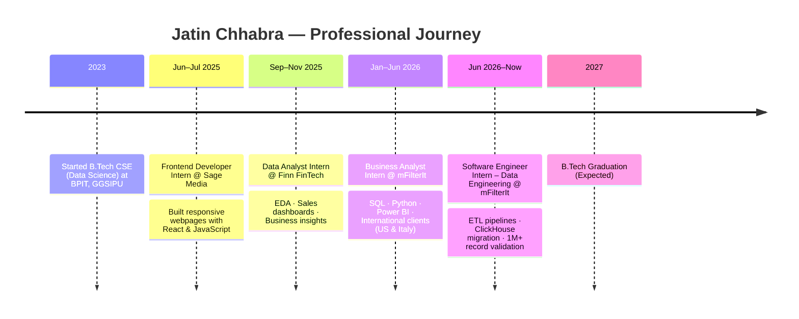
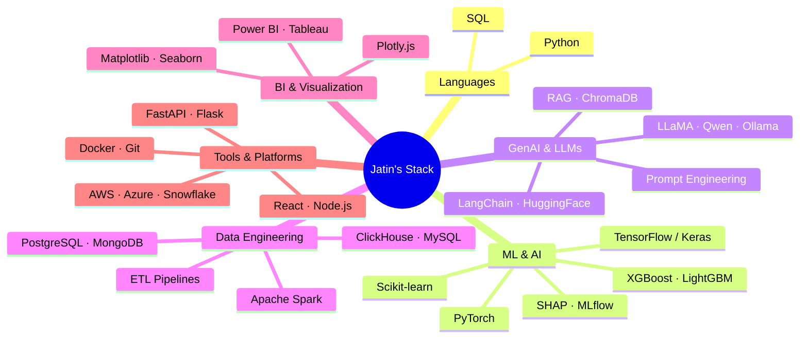
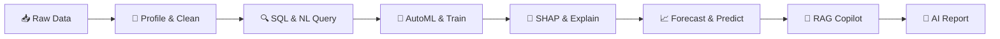
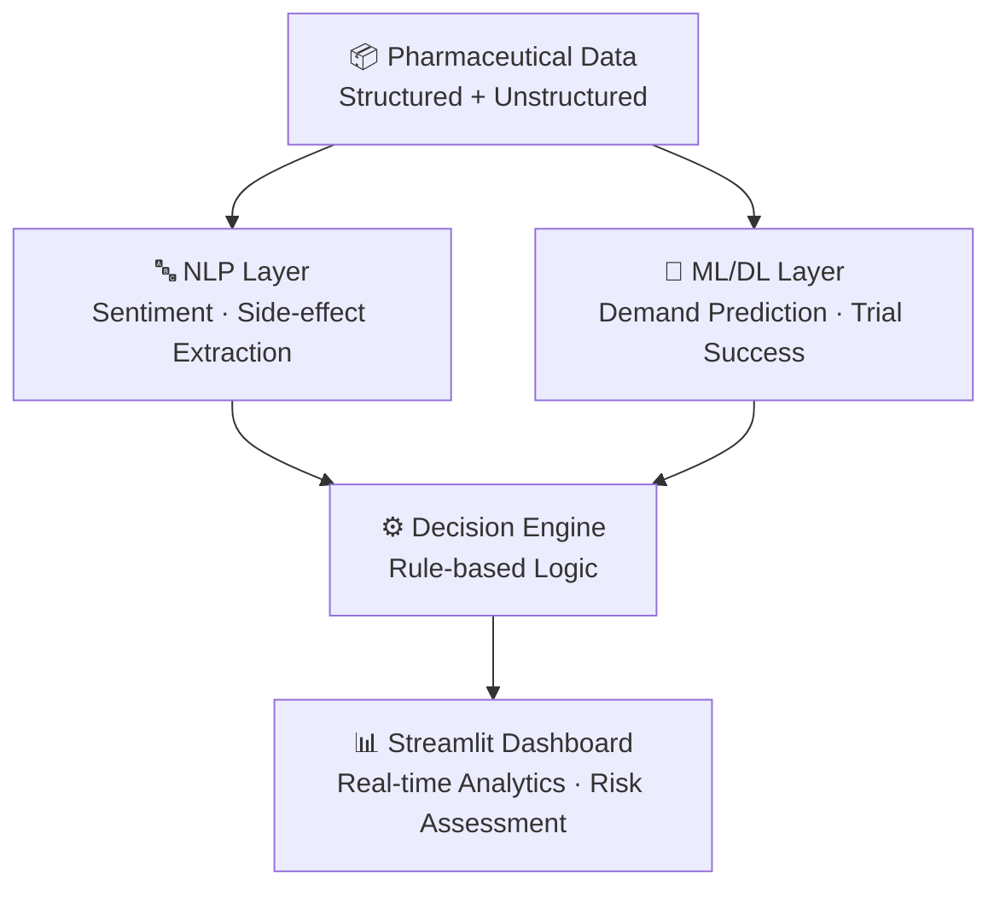
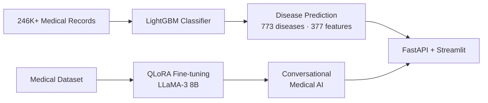
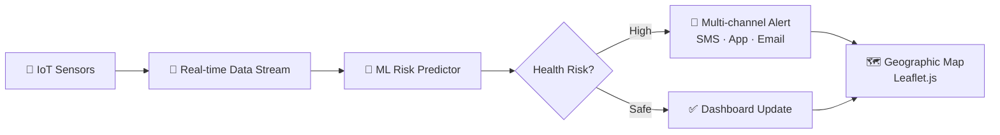
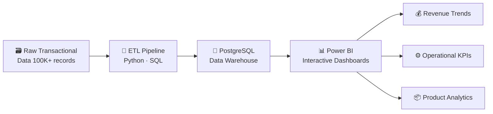

 

---

## 👨‍💻 About Me

Data Science, AI & Data Engineering enthusiast with hands-on experience in analytics, machine learning, and production data engineering. I specialize in **end-to-end AI solutions** — from raw data ingestion to intelligent, production-ready systems.

> *"Building intelligent systems that solve real-world problems — one pipeline, one model, one insight at a time."*

| | |
|---|---|
| 🔭 **Currently** | Software Engineer Intern – Data Engineering @ **mFilterIt** |
| 🎓 **Education** | B.Tech CSE (Data Science), BPIT GGSIPU — CGPA **9.1/10** (2023–2027) |
| 🛠️ **Core Stack** | Python · SQL · Power BI · FastAPI · ClickHouse · AWS |
| 🧠 **Specialization** | ETL Pipelines · ML/DL · NLP · LLMs · RAG · Agentic AI |
| 🌱 **Learning** | MLOps · Cloud · Edge AI · AI Automation |
| 📫 **Reach me** | jatin.chhabra22jc@gmail.com |

---

## 🗺️ My Journey

---

## 💼 Experience

### Software Engineer Intern – Data Engineering · mFilterIt *(June 2026 – Present)*
- Built **Python & SQL pipelines** to ingest, clean, transform, and validate large-scale datasets
- Contributed to **MySQL → ClickHouse migration**, optimizing query performance for high-volume workloads
- Performed **API & production pipeline validation** on live dashboards handling **1M+ records** via FastAPI & Postman

`Python` `SQL` `ClickHouse` `MySQL` `FastAPI` `AWS` `Data Science` `ML` `NLP` `GenAI`

### Business Analyst Intern · mFilterIt *(Jan 2026 – Jun 2026)*
- Analyzed & visualized business data for international clients (US & Italy) using SQL, Python, Excel & Power BI
- Delivered KPI tracking dashboards, data cleaning, EDA, and actionable business insights

`SQL` `Python` `Power BI` `Excel`

### Data Analyst Intern · Finn FinTech *(Sep 2025 – Nov 2025)*
- Performed EDA on sales data to highlight factors impacting business performance
- Developed sales tracking dashboards for monthly performance reviews

`Excel` `SQL` `Python`

### Frontend Developer Intern · Sage Media *(Jun 2025 – Jul 2025)*
- Built and updated responsive webpages, implemented UI changes based on design feedback

`React` `JavaScript` `CSS`

---

## 🛠️ Tech Stack

 

### Skill Proficiency

| Skill | Level |
|---|---|
| Python | `████████████████████` 95% |
| SQL | `███████████████████░` 90% |
| Machine Learning | `██████████████████░░` 85% |
| Data Engineering | `█████████████████░░░` 82% |
| Power BI | `████████████████░░░░` 80% |
| Deep Learning | `███████████████░░░░░` 78% |
| NLP & Gen AI | `██████████████░░░░░░` 75% |
| Cloud (AWS/Azure) | `███████████░░░░░░░░░` 65% |

---

## ⭐ Featured Projects

### 🤖 1. InsightAI — AI Data Intelligence Platform
> End-to-end AI platform unifying dataset analysis, AutoML, forecasting, explainable AI, RAG Copilot, and AI-generated reporting.

- **390+ backend tests** · JWT + RBAC security · Workspace collaboration · Model registry
- **Tech:** `Python` `FastAPI` `React` `TypeScript` `PostgreSQL` `XGBoost` `Prophet` `MLflow` `ChromaDB` `Ollama` `RAG` `SHAP`

---

### 🏥 2. AI Pharma Decision System
> 4-layer AI system integrating NLP, ML, Deep Learning, and a rule-based Decision Engine for pharmaceutical decision-making.

- **Tech:** `Python` `Scikit-learn` `TensorFlow` `NLP` `Streamlit`

---

### 🩺 3. DocBuddy — Medical AI Symptom Analysis & LLM Fine-Tuning
> Dual-model system combining LightGBM classification with QLoRA fine-tuned LLaMA-3 8B for symptom prediction and conversational medical AI.

- **Tech:** `LightGBM` `LLaMA-3 8B` `QLoRA` `PEFT` `HuggingFace` `FastAPI` `Streamlit`

---

### 💧 4. NeerSetu — Water Quality Monitoring
> IoT + ML-powered water quality monitoring system for rural communities with real-time alerts and geographic mapping.

- Real-time sensor data · AI health risk prediction · Mobile app · Multi-channel alerts
- **Tech:** `React` `React Native` `Node.js` `Python` `FastAPI` `MongoDB` `Leaflet`

---

### 📊 5. OrderFlow — E-Commerce Sales Analytics
> Processed 100K+ records with automated ETL into PostgreSQL, visualized through interactive Power BI dashboards.

- **Tech:** `Python` `SQL` `PostgreSQL` `Power BI`

---

### 🍔 6. Swiggy Analytics — Food Delivery Insights
> SQL-powered analytics uncovering demand patterns, top-performing restaurants, and city-level growth opportunities.

- **Tech:** `Python` `SQL` `PostgreSQL` `Power BI`

---

## 📂 More Projects

| Project | Description | Tech | Link |
|---|---|---|---|
| **Smart Attendance App** | AI face recognition attendance + ML prediction + NLP task recommendations | React, Node.js, Python, Flask, MySQL, dlib | [🔗](https://github.com/JatinChhabra22/Smart-Attendance-Cirrculam-App) |
| **OTT Platform Analysis** | EDA of Netflix, Prime & Disney+ content trends | Python, Pandas, Matplotlib | [🔗](https://github.com/JatinChhabra22/OTT-Analysis-) |
| **NovaStat** | Govt survey data processing with bias detection & MoSPI reports | React, FastAPI, Pandas, Plotly.js | [🔗](https://github.com/JatinChhabra22/NovaStat) |
| **UPI Transaction Analysis** | EDA of 15,000+ UPI transactions — patterns, failures & trends | Python, Pandas, Matplotlib | [🔗](https://github.com/JatinChhabra22/UPI-Transaction-Analysis-) |

---

## 📊 GitHub Stats

 

<!--  !-->

---

## 📜 Certifications

| Certification | Platform |
|---|---|
| Complete Data Science, ML, DL & NLP Bootcamp | Udemy |
| Complete Data Analyst Bootcamp | Udemy |
| Complete Generative AI Course with LangChain & HuggingFace | Udemy |
| The Ultimate Job-Ready Data Science Course | Code with Harry |

---

## 📫 Let's Connect

I'm always open to collaborating on **AI/ML projects**, **data engineering challenges**, and **innovative data products**.

| Platform | Link |
|---|---|
| 📧 Email | jatin.chhabra22jc@gmail.com |
| 💼 LinkedIn | [jatin-chhabra](https://www.linkedin.com/in/jatin-chhabra-2b0455289/) |
| 💻 Portfolio | [jatin-chhabra-22.vercel.app](https://jatin-chhabra-22.vercel.app/) |

 

